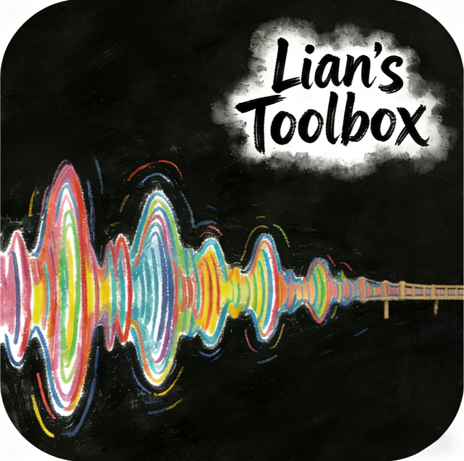

# 连析工坊 (Lianalytica)

> We don't generate music. We generate understanding. 我们不是生成音乐，而是生成理解

<div align="center">
  
  <br>
  <br>
  <p>🎵 创作者的「听觉显微镜」与「思维脚手架」</p>
  <br>
  
  
  
  
  
</div>

## 📖 项目简介

连析工坊 (Lianalytica) 是一个**全平台离线大模型运行时系统**，专注于为创作者提供深度分析工具，而非取代创作本身。

我们反对 AI 取代人类创作，而是将 AI 定位为创作者的辅助工具：
- 👂 **听觉显微镜**：深入解析音乐作品的结构、和声与情感
- 🧠 **思维脚手架**：为代码调试、创意构思提供结构化支撑
- 💬 **智能对话伙伴**：基于本地大模型的安全对话系统

## 🌸 设计理念

### 核心价值观
- ✨ **分析而非生成**：专注于深度解析，而非表面创作
- 🎨 **辅助而非取代**：成为创作者的得力助手，而非竞争对手
- 🌐 **全平台支持**：Windows/macOS/Android/iOS/HarmonyOS 全覆盖
- 🛡️ **离线安全**：本地运行所有模型，保护用户隐私与创意安全

### 可爱风 WebUI 设计
- 🎨 **渐变背景**：柔和的粉色系渐变 `linear-gradient(135deg, #fff5f7 0%, #ffe4e6 100%)`
- 🌸 **圆角边框**：统一的 `border-radius: 20px` 设计语言
- ✨ **表情装饰**：精心设计的 emoji 点缀（🌸, ✨, 😊）
- 😽 **萌系交互**："~本喵知道啦~(~关闭~）" 特色关闭按钮

## 🎯 核心功能

### 🎵 音乐创作者工具
- **和弦分析**：自动识别音乐中的和弦进行与和声结构
- **人声配和弦**：为人声音频生成匹配的和弦进行
- **音频转 MIDI**：将音频转换为 MIDI 格式描述
- **音频分离**：分离人声、鼓、贝斯、吉他等轨道
- **AI一键修音大师**：专业级AI修音大模型，支持复杂类歌曲人声处理，用户可自定义修音精准度
- **DAW工程导出**：导出主流DAW工程文件（Cubase、FL Studio、Ableton等），包含麦乐迪VST3 64位插件和修好的歌曲人声工程
- **AI音乐打谱大师**：通过文字描述生成完整专业打谱软件通用文件（MusicXML格式），支持导入MuseScore等专业打谱软件

### 💻 程序员工具
- **代码分析**：深入理解代码结构与功能
- **调试建议**：智能识别潜在问题与优化方向
- **代码生成**：基于分析的辅助代码生成
- **文档生成**：自动生成代码注释与文档

### 🤖 通用对话
- **智能问答**：基于本地大模型的安全问答系统
- **内容创作辅助**：提供创意构思与内容优化建议
- **多语言支持**：基于地理定位的自动语言切换

## 🛠️ 技术栈

### 后端
- **Python Flask**：轻量级 Web 服务器框架
- **Ollama**：本地大模型运行时，支持 Llama3、Mistral 等
- **psutil**：系统进程监控与管理
- **subprocess**：本地命令执行与进程管理

### 前端
- **HTML5/CSS3**：现代化 Web 界面
- **JavaScript**：交互式功能实现
- **i18next**：多语言支持框架
- **响应式设计**：适配各种屏幕尺寸

### 跨平台
- **Windows**：一键安装脚本 + EXE 启动器
- **macOS**：DMG 安装包
- **Android/iOS**：WebApp + 本地运行时
- **HarmonyOS**：原生应用支持

## 🌱 项目起源

连析工坊诞生于一位神经多样性创作者的真实需求。作为音乐爱好者与程序员，我发现：

- 传统音乐分析工具过于专业，学习曲线陡峭
- 现有 AI 音乐工具过度强调「生成」，忽视「理解」
- 在线 AI 工具存在隐私风险，创意成果可能被窃取
- 跨平台支持不足，创作者在不同设备间切换困难

因此，我开发了连析工坊，希望为所有创作者提供一个安全、易用、专业的分析工具。

## 📦 安装与使用

### 快速开始

#### Windows 用户（推荐）
```bash
# 1. 下载一键安装脚本
install_ollama.bat

# 2. 运行启动器
OllamaWebUI_GPU.exe

# 3. 访问界面
http://localhost:8001
```

#### 从源码运行
```bash
# 安装依赖
pip install -r requirements.txt

# 启动服务
python server.py
```

### 启动器版本

| 版本 | 适用场景 | 推荐配置 |
|------|---------|---------|
| `OllamaWebUI_CPU.exe` | 无 GPU 系统 | 4GB+ RAM |
| `OllamaWebUI_GPU.exe` | NVIDIA GPU 系统 | NVIDIA GPU (CUDA 11.0+) |
| `OllamaWebUI_GPU_MEM.exe` | 高端设备 | 16GB+ RAM + NVIDIA GPU |

## 🔧 技术实现细节

### 离线大模型运行
```python
# server.py - 本地 Ollama 交互示例
config = get_config()
ollama_url = f'http://{config["host"]}:{config["port"]}/api/generate'

# 所有请求都发送到本地 Ollama 服务
response = requests.post(ollama_url, headers=headers, json=request_data)
```

### 多语言支持
```javascript
// 基于地理定位自动切换语言
const userLang = navigator.language;
loadLanguage(userLang || 'zh-CN');
```

### 任务管理系统
```python
# 线程安全的任务管理
with tasks_lock:
    active_tasks.append({
        'id': task_id,
        'type': task_type,
        'description': description,
        'status': 'running',
        'progress': 0,
        'progress_text': '任务开始',
        'start_time': time.time()
    })
```

## 📁 项目结构

```
连析工坊/
├── index.html          # 前端 Web 界面
├── server.py           # Python 后端服务器
├── main.py             # 应用入口文件
├── config.json         # 配置文件
├── requirements.txt    # Python 依赖
├── locales/            # 多语言文件
│   ├── zh-CN.json      # 中文翻译
│   └── en.json         # 英文翻译
├── temp/               # 临时文件目录
└── README.md           # 项目文档
```

## 🎨 UI/UX 特色

- **可爱风设计**：柔和渐变背景 + 圆角元素 + emoji 装饰
- **响应式布局**：完美适配桌面、平板、手机
- **智能语言切换**：基于 `navigator.language` 自动选择语言
- **安全关闭按钮**：特色 "~本喵知道啦~(~关闭~）" 设计
- **实时进度显示**：任务处理状态可视化

## 🔒 隐私与安全

- ✅ **本地运行**：所有模型与数据处理都在本地完成
- ✅ **无网络依赖**：不连接任何外部 API 或服务器
- ✅ **隐私保护**：不收集任何用户数据或使用信息
- ✅ **数据安全**：自动清理临时文件，保护创意成果

## 🤝 贡献指南

我们欢迎所有开发者的贡献！

### 开发环境搭建
```bash
# 克隆仓库
git clone https://github.com/yourusername/lianalytica.git
cd lianalytica

# 安装依赖
pip install -r requirements.txt

# 启动开发服务器
python server.py
```

### 提交代码
- 遵循 PEP 8 代码规范
- 提交前运行 `flake8` 检查
- 编写清晰的 commit 信息

## 📄 许可证

本项目采用 MIT 许可证，详见 [LICENSE](LICENSE) 文件。

## 🙏 感谢

- **Ollama**：提供优秀的本地大模型运行时
- **Flask**：轻量级 Web 框架
- **所有贡献者**：感谢每一位参与开发的朋友

## 📞 联系我们

- **项目主页**：https://github.com/yourusername/lianalytica
- **问题反馈**：https://github.com/yourusername/lianalytica/issues
- **开发者**：连毅霖

---

© 2025 连析工坊(Lianalytica)连毅霖版权所有

> We don't generate music. We generate understanding. 我们不是生成音乐，而是生成理解